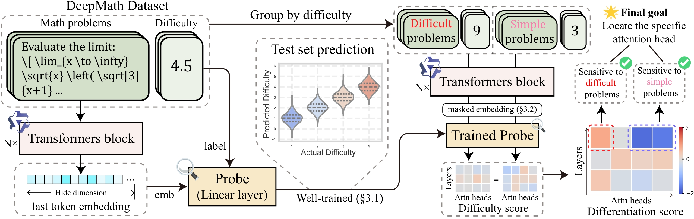

# LLMs Intrinsic Difficulty Perception

Code for paper `Probing Implicit Difficulty Perception in Large Language Models`.

## Pipeline



## Probe Model

How to load Qwen2.5-7B-Instruct's profile model:

```python
import torch
import torch.nn as nn

class RegressionNN(nn.Module):
    def __init__(self, input_dim):
        super().__init__()
        self.linear = nn.Linear(input_dim, 1)
    def forward(self, x):
        return self.linear(x)

lieanr_model = torch.load('models/difficulty_probe_qwen2.5.pth')
```

We also provide the probe weights for DeepSeek-R1-Distill_Qwen-7B and Llama3.1-8B-Instruct, which can be loaded similarly.

We provide the weights of Qwen2.5-7B-Instruct separately, and it is easy to separate weights from the model. When calculating the difficulty score in attention module, it is only necessary to directly load the probe weights, for example:

```python
probe_weight = torch.load('models/difficulty_vector_qwen2.5.pth')
```

## Attention Heads Ablation

Refer to `attn_head_ablation.py`.

## Attention Head Perceptual Control

Refer to `deepmath_weighted_llm_emb.py`.


## Citation

```
@misc{lee2025probingdifficultyperceptionmechanism,
      title={Probing the Difficulty Perception Mechanism of Large Language Models}, 
      author={Sunbowen Lee and Qingyu Yin and Chak Tou Leong and Jialiang Zhang and Yicheng Gong and Shiwen Ni and Min Yang and Xiaoyu Shen},
      year={2025},
      eprint={2510.05969},
      archivePrefix={arXiv},
      primaryClass={cs.CL},
      url={https://arxiv.org/abs/2510.05969}, 
}
```
